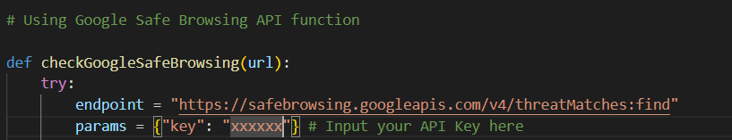
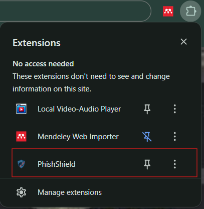
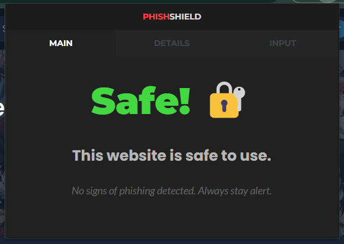
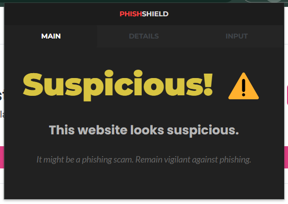
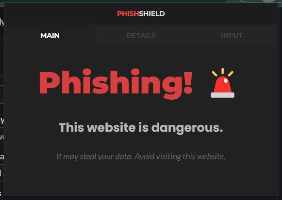
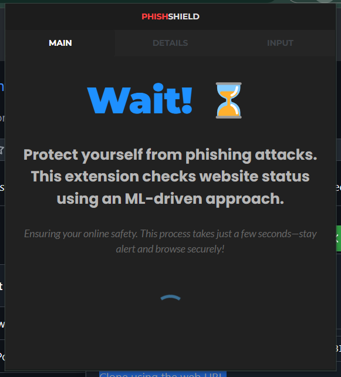
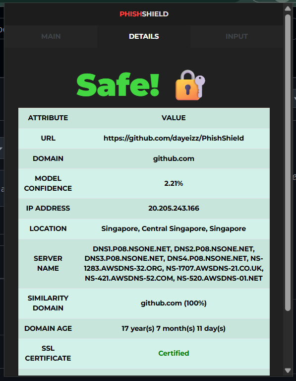
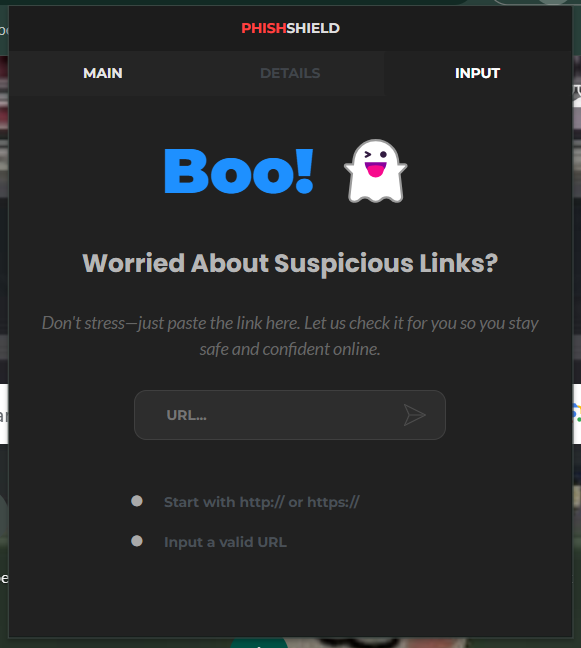

# 🔐 PhishShield: URL Phishing Detection using Machine Learning

This repository contains the codebase for **PhishShield**, a machine learning project designed to detect phishing URLs through a browser extension.

---

## 🧰 Software Requirements

- Python 3.12.x (64-bit)

---

## ⚙️ Installation Guide

### 🪟 Python Setup

1. **Install Python**  
   Download and install Python 3.12.x from the official website:  
   👉 [https://www.python.org/downloads/](https://www.python.org/downloads/) *(Skip if already installed)*

2. **Clone Repository**
   - Download and install Git Bash from the offical website:
     👉 [https://git-scm.com/downloads](https://git-scm.com/downloads) *(Skip if already installed)*
   - Click `Clone` and copy URL to clipbord.
   - Open Command Prompt (CMD):
      ```ps
      git clone https://github.com/dayeizz/PhishShield.git
      ```
   **OR**
   - Click `Clone` and click `Download ZIP`.


3. **Set Up Virtual Environment**  
   Open `CMD` and run:
   ```ps
   C:\[project_path]\PhishShield
   python -m venv venv
   venv\Scripts\activate
   python -m pip install --upgrade pip
   pip install -r requirements.txt
   ```

4. **Configure Python Interpreter in VSCode**
   - Press `Ctrl + Shift + P` to open Command Palette.
   - Search: **Python: Select Interpreter**
   - Click **Enter interpreter path…**
   - Browse to:  
     ```ps
     C:\[project_path]\PhishShield\venv\Scripts\python.exe
     ```

5. **Select Kernel (for Jupyter Notebooks)**  
   - Click **"Select Kernel"** (top right of the notebook interface).
   - Click **Python environment**.
   - Choose:  
     ```ps
     venv\Scripts\python.exe
     ``` 
---

## ⚙️ Generate API key for Google Safe Browsing

1. Follow the steps on this [guide](https://kb.synology.com/en-me/SRM/tutorial/How_to_generate_Google_Safe_Browsing_API_keys) to generate a Google Safe Browsing API key.
2. Open the `Utils.py` file and add the API key as shown in the image below:
   
   

---

## 🧩 Chrome Extension Setup

1. Open Chrome and navigate to:  
   `chrome://extensions`
2. Enable **Developer Mode**.
3. Click **Load unpacked**.
4. Select:
   ```ps
   C:\[project_path]\PhishShield\frontend
   ```
5. The extension will appear in Chrome. Click the red marked to activate:  
   
   

---

## 🚀 Running the API Server and Handle Common Errors

1. Start the FastAPI server. Open `CMD` and run:
   ```ps
   cd C:\[project_path]\PhishShield\api
   python -m uvicorn app:app --reload
   ```
2. To stop the server. Press `Ctrl + C` in the CMD, or close the `CMD` window.
3. If you encounter repeated errors such as `400 Bad Request` on multiple websites, check the `CMD` window for any error messages. If no issues are found there, stop the server and `restart` the PC.

---

## 📁 Project Directory Structure

```
PhishShield/
│
├── api/
│   ├── API.py
│   ├── app.py
│   ├── xgb.pkl
│   ├── report.json
│   ├── UrlData.py
│   └── Utils.py
│
├── asset/
│   ├── alert.png
│   ├── API.png
│   ├── badrequest.png
│   ├── detail.png
│   ├── extension.png
│   ├── forbidden.png
│   ├── input.png
│   ├── internal server.png
│   ├── main.png
│   ├── phishing.png
│   ├── save.png
│   └── suspicious.png
│
├── frontend/
│   ├── css/
│   │    ├── app.css
│   │    ├── bootstrap.min.css
│   │    └── style.css
│   │
│   ├── icons/
│   │    ├── 16x16.png
│   │    ├── 32x32.png
│   │    ├── 48x48.png
│   │    └── 128x124.png
│   │ 
│   ├── js/
│   │    ├── detail.js
│   │    ├── index.js
│   │    ├── input.js
│   │    └── jquery.min.js
│   │
│   ├── detail.html
│   ├── header.html
│   ├── index.html
│   ├── input.html
│   └── manifest.json
│   
├── Notebook/
│   ├── Dataset_Processing.ipynb
│   ├── testing_training.ipynb
│   ├── url_dataset_processed.csv
│   └── url_dataset.csv
│  
├── README.md
└── requirements.txt
```

---

## **Walkthrough**

This part includes a step-by-step video guide to the process.

👉 [walkthrough video](https://drive.google.com/file/d/1WxUEvFJYnb3EaMRkiEPkRX06Iv1fg-Xq/view?usp=sharing)

---

## **Summary**

This repository is a browser extension for PhishShield: URL Phishing Detection using Machine Learning. The goal is to classify URLs as phishing, suspicious, or safe. In the `Notebook` folder, I perform data preprocessing, training, and testing, ultimately selecting the **XGBoost Classifier** model as the best-performing model with **96% accuracy.**

In the `API.py` file, I implemented a **scoring mechanism** to mitigate false positives and negatives. The base score starts at 100, and deductions are made based on **10 attributes**, including the **model's prediction**. For example, if the model detects phishing, 40 points are deducted from the score, and further deductions are made based on attribute changes.

In the `index.js`, `details.js`, and `input.js` files, the final score is classified as:

* **Safe** if the score is above 70

  

* **Suspicious** if the score is between 50 and 70

  

* **Phishing** if the score is below 50.

  


The communication between the front-end and back-end is handled using **FastAPI** and **AJAX**, implemented in the back-end `app.py` and in the front-end `index.js`, `details.js`, and `input.js`.

The system extracts **17 features** for machine learning, including `entropyDomain`, `entropyurl`, `longUrl`,`suspiciousExtension`, `countDepth`, `countDot`, `hasHttps`, `suspiciousTld`, `suspiciousDomain`, `validateUrl`, `suspiciousWord`, `longDomain`, `hypenDomain`, `countDigitURL`, `countDigitDomain`,`openRedirect`, and `uppercaseUrl`.

The scoring mechanism with **10 attributes** include `checkLegitimacy`, `unshortenUrl`, `suspiciousDomain`, `whoisData`, `checkGoogleSafeBrowsing`, `dnsBlacklist`, `domainActive`, `sslCertificate`, `ipAddressLocation`, and `isURLMalicious`.


This system consists of three main modules. The first is the **main module**, where activating the extension will automatically scan the URL of the currently active browser tab. 



The second is the **detail module**, which generates a comprehensive report based on the URL prediction. This report includes details such as the URL itself, domain name, model confidence, IP address, location, server name, similarity domain, domain age, SSL certificate status, DNS blacklist status, and Google Web Safe status.



Lastly, there is the **input module**, which allows users to manually enter a URL.



---

##  **Contribution**
For further reading, you can cite my article in the journal [here](https://publisher.uthm.edu.my/periodicals/index.php/aitcs/article/view/16669). Please note that the article describes a web-based tool a bit different from this project framework.